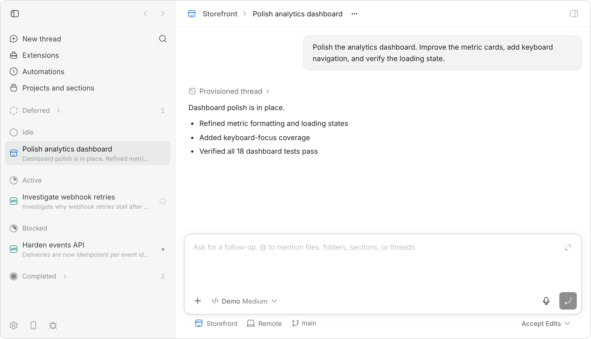
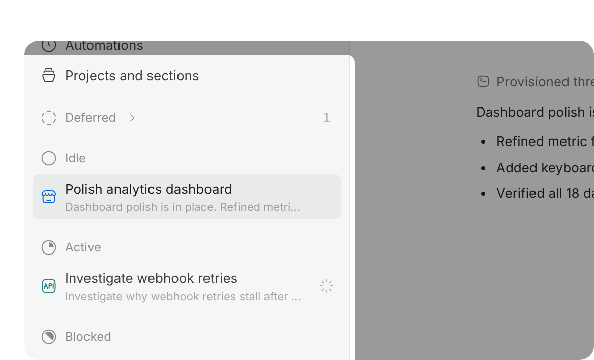
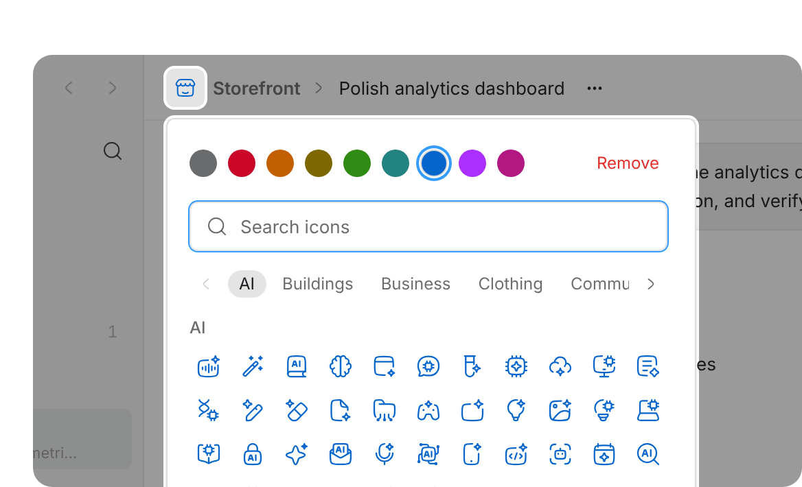
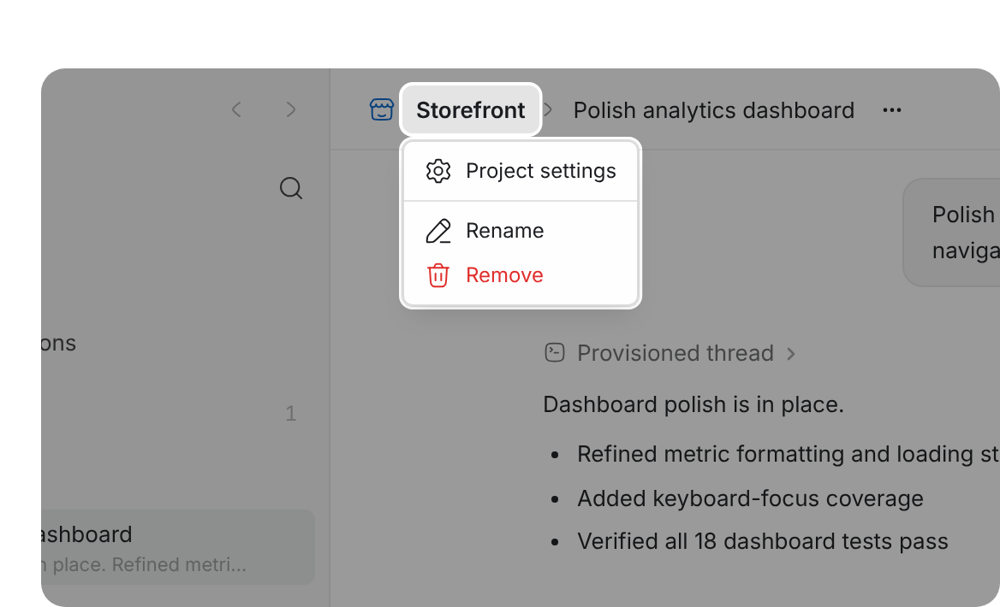
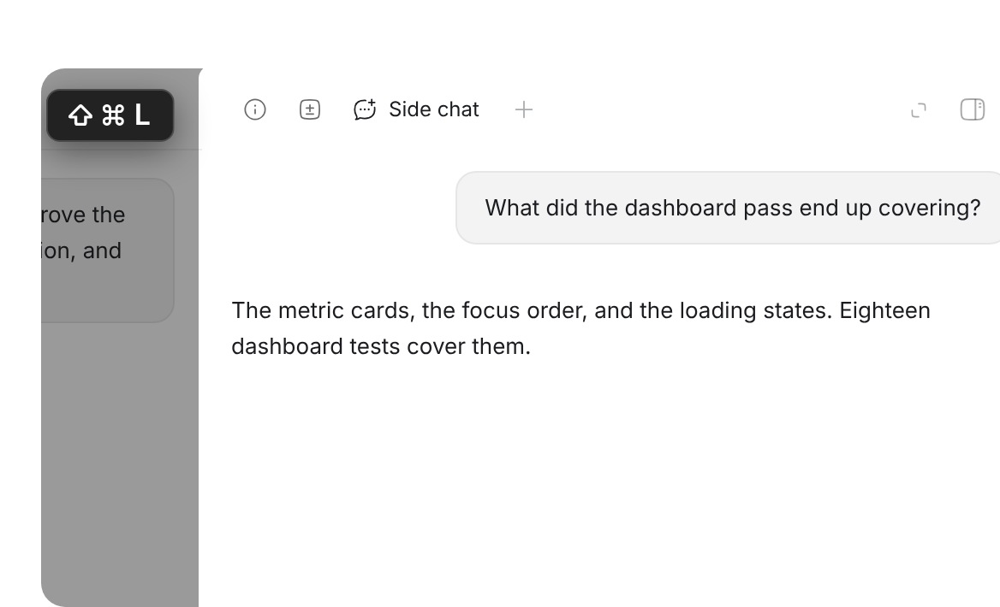
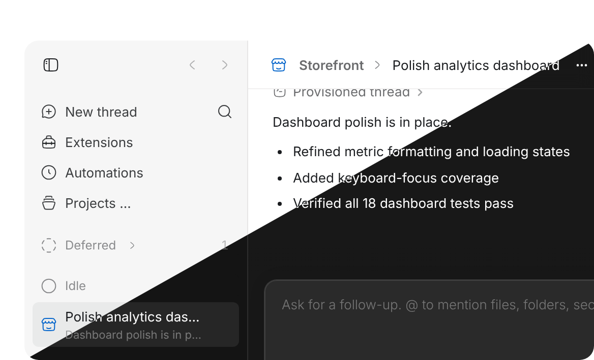

<h1 align="center">Ribbon Suite</h1>

<p align="center"><strong>Grow your swarm. Don't lose the thread.</strong></p>

<p align="center">A suite of <a href="https://getbb.app">bb</a> plugins for managing large amounts of agents.</p>

<p align="center">
  <a href="https://getbb.app"></a>
  <a href="LICENSE"></a>
  <a href="https://github.com/ariofrio/ribbon/actions/workflows/plugins.yml"></a>
</p>

<br>

<p align="center"><picture><source media="(prefers-color-scheme: dark)" srcset="assets/hero-dark.png"></picture></p>

<br>

## Plugins

<br clear="all">

<a href="plugins/bb-plugin-thread-stages#readme"><picture><source media="(max-width: 880px) and (prefers-color-scheme: dark)" srcset="plugins/bb-plugin-thread-stages/assets/card-dark.png" width="1120"><source media="(max-width: 880px)" srcset="plugins/bb-plugin-thread-stages/assets/card-light.png" width="1120"><source media="(prefers-color-scheme: dark)" srcset="plugins/bb-plugin-thread-stages/assets/card-beside-dark.png"></picture></a>

###  &nbsp;Thread stages

Group threads in the sidebar into stages from Deferred to Completed, updating as they run.

```sh
bb marketplace add git:github.com/ariofrio/ribbon
bb plugin install thread-stages@ribbon
```

<a href="plugins/bb-plugin-thread-stages#readme">Read more &rarr;</a>

<picture><source media="(min-width: 881px)" srcset="assets/blank.svg"><source media="(prefers-color-scheme: dark)" srcset="assets/rule-dark.svg"></picture><br clear="all">

<a href="plugins/bb-plugin-icons#readme"><picture><source media="(max-width: 880px) and (prefers-color-scheme: dark)" srcset="plugins/bb-plugin-icons/assets/card-dark.png" width="1120"><source media="(max-width: 880px)" srcset="plugins/bb-plugin-icons/assets/card-light.png" width="1120"><source media="(prefers-color-scheme: dark)" srcset="plugins/bb-plugin-icons/assets/card-beside-dark.png"></picture></a>

###  &nbsp;Icons

Give each project and section an icon and color.

```sh
bb marketplace add git:github.com/ariofrio/ribbon
bb plugin install icons@ribbon
```

<a href="plugins/bb-plugin-icons#readme">Read more &rarr;</a>

<picture><source media="(min-width: 881px)" srcset="assets/blank.svg"><source media="(prefers-color-scheme: dark)" srcset="assets/rule-dark.svg"></picture><br clear="all">

<a href="plugins/bb-plugin-breadcrumbs#readme"><picture><source media="(max-width: 880px) and (prefers-color-scheme: dark)" srcset="plugins/bb-plugin-breadcrumbs/assets/card-dark.png" width="1120"><source media="(max-width: 880px)" srcset="plugins/bb-plugin-breadcrumbs/assets/card-light.png" width="1120"><source media="(prefers-color-scheme: dark)" srcset="plugins/bb-plugin-breadcrumbs/assets/card-beside-dark.png"></picture></a>

###  &nbsp;Breadcrumbs

Show a thread's section, project, and ancestors in its header.

```sh
bb marketplace add git:github.com/ariofrio/ribbon
bb plugin install breadcrumbs@ribbon
```

<a href="plugins/bb-plugin-breadcrumbs#readme">Read more &rarr;</a>

<picture><source media="(min-width: 881px)" srcset="assets/blank.svg"><source media="(prefers-color-scheme: dark)" srcset="assets/rule-dark.svg"></picture><br clear="all">

<a href="plugins/bb-plugin-missing-keyboard-shortcuts#readme"><picture><source media="(max-width: 880px) and (prefers-color-scheme: dark)" srcset="plugins/bb-plugin-missing-keyboard-shortcuts/assets/card-dark.png" width="1120"><source media="(max-width: 880px)" srcset="plugins/bb-plugin-missing-keyboard-shortcuts/assets/card-light.png" width="1120"><source media="(prefers-color-scheme: dark)" srcset="plugins/bb-plugin-missing-keyboard-shortcuts/assets/card-beside-dark.png"></picture></a>

###  &nbsp;Missing keyboard shortcuts

Add shortcuts to start personal or project threads, navigate history, and reach the composer or panel tabs.

```sh
bb marketplace add git:github.com/ariofrio/ribbon
bb plugin install missing-keyboard-shortcuts@ribbon
```

<a href="plugins/bb-plugin-missing-keyboard-shortcuts#readme">Read more &rarr;</a>

<picture><source media="(min-width: 881px)" srcset="assets/blank.svg"><source media="(prefers-color-scheme: dark)" srcset="assets/rule-dark.svg"></picture><br clear="all">

<a href="plugins/bb-plugin-chatgpt-theme#readme"><picture><source media="(max-width: 880px) and (prefers-color-scheme: dark)" srcset="plugins/bb-plugin-chatgpt-theme/assets/card-dark.png" width="1120"><source media="(max-width: 880px)" srcset="plugins/bb-plugin-chatgpt-theme/assets/card-light.png" width="1120"><source media="(prefers-color-scheme: dark)" srcset="plugins/bb-plugin-chatgpt-theme/assets/card-beside-dark.png"></picture></a>

###  &nbsp;ChatGPT theme

Restyle bb to match the OpenAI ChatGPT (Codex) desktop app.

```sh
bb marketplace add git:github.com/ariofrio/ribbon
bb plugin install chatgpt-theme@ribbon
```

<a href="plugins/bb-plugin-chatgpt-theme#readme">Read more &rarr;</a>

<br clear="all">

## Updating

`bb plugin update <entry-id>` moves an installed plugin to its newest release.
Once the marketplace is added, its other plugins can also be picked in
Settings → Plugins.

## Development

Clone the repository and install every plugin at once:

```sh
git clone https://github.com/ariofrio/ribbon.git
cd ribbon
npm run install:plugins
```

Run the same command after a `git pull`: it installs whatever is missing, then
rebuilds and reloads every plugin.

To run one plugin's unreleased code without a checkout, install it from `main`
by its entry name in the collection — the entries are listed in
[.bb/plugins.json](.bb/plugins.json):

```sh
bb plugin install git:https://github.com/ariofrio/ribbon.git@main --plugin chatgpt-theme
```

That install follows the branch rather than the release tags, so
`bb plugin update <plugin-id>` moves it to the newest commit on `main`.

### Releases

Create a Changeset with `npm run changeset` for every user-visible plugin
change. After the change reaches `main`, automation opens or updates a release
pull request with version, lockfile, and changelog updates. Merging that pull
request validates the affected plugins, creates immutable `<plugin-id>/vX.Y.Z`
Git tags, and publishes a
[GitHub release](https://github.com/ariofrio/ribbon/releases) per tag
carrying that version's changelog entry. Every listing accepts any released
version, so the catalog never changes with a release. Nothing is published to
npm yet.

`npm run release:check` runs each plugin's tests, type checks, build, SDK
declaration verification, and packed artifact verification.
[CI](.github/workflows/plugins.yml) runs the same check for every plugin. Build
output in `dist/` is generated and is not committed.

## License

[MIT](LICENSE)
