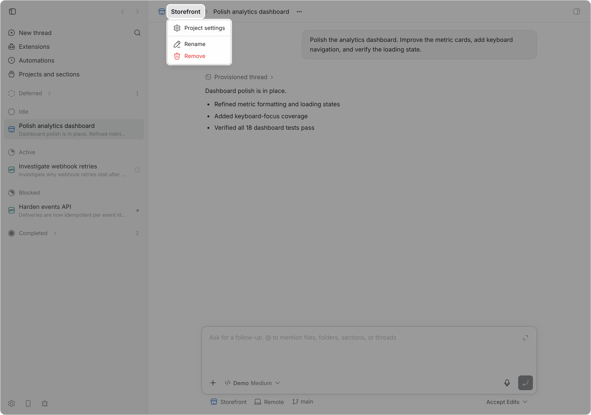

# Breadcrumbs

Adds a trail to each thread header — the thread's section, its project, and its
parent and ancestor threads:

```text
Release  >  bb-plugins  >  Polish the sidebar  >  Trace the timer
```

Each part is turned on and off on its own in the plugin's settings. The section
and the project start on; the ancestors start off, because most threads have
none and the ones that do are already nested in the sidebar. A thread with none
of them keeps bb's header exactly as it was.

<picture>
  <source media="(prefers-color-scheme: dark)" srcset="assets/screenshot-dark.png">
  
</picture>

The project name uses the same muted, hoverable treatment as bb's project
settings breadcrumb. The existing thread title node is left in place, so it
retains bb's normal-weight thread-header typography.

Clicking the project name opens a menu containing:

- Project settings
- Rename
- Remove

Project settings navigates inside bb's router. Rename and Remove use
version-matched bb dialog components and call the plugin backend, which applies
the mutation through bb's project SDK. The actions do not depend on the
sidebar or its project menu being mounted.

Clicking the section name opens what bb's own sidebar section header opens —
Rename and Remove, carrying bb's wording, including that removing a section
moves its threads back to Unorganized. Sections attach to root threads, so a
child shows the section its root is in. Clicking an ancestor opens that thread.

A fork is not an ancestor here. bb gives a thread spawned under another a
`parentThreadId` and nests it in the sidebar, while a fork gets a
`sourceThreadId` and no parent, so it sits at the root; the trail follows the
first and leaves the second to where bb already shows it.

## Implementation

The plugin registers `experimental_threadHeaderAction` and asks its own
backend for the whole trail at once. It does not read the sidebar's live view:
that hydrates in pieces, so a header can mount while it still reports no
projects and no threads, and nothing corrects it — bb publishes no event a
plugin can hear when a section is created, renamed, or removed. One call
returns the section, the project, and every ancestor together, so the crumbs
settle as a unit, and it is asked again on focus and before a menu opens. Its
otherwise-hidden slot inserts a React portal immediately before bb's existing
thread-title container. The frontend action dialogs call schema-validated RPC
handlers registered by `src/server.ts` for project rename and removal.

This deliberately relies on bb's private thread-header DOM structure because
the plugin SDK has no title-prefix slot. `src/header-dom.test.ts` documents and
tests the expected structure so a future bb header change fails locally rather
than silently changing the thread title.

## Sharing the header with Icons

Both plugins put a node at the head of bb's header, so neither may assume it
arrives first: each finds bb's title by what it holds rather than by position,
skipping anything marked as a plugin's root.

Each crumb is preceded by an empty span marked
`data-breadcrumb-icon-anchor`, naming the section or project it belongs to, and
[Icons](../bb-plugin-icons#readme) draws that owner's icon into it. bb's SDK
lets no plugin render another's component, and the icons belong between the
crumbs. Nothing here checks whether that plugin is installed: an unfilled
anchor draws nothing and takes no space.

The crumbs render in a React root of their own, on an animation frame. bb
guards its React tree and will not put a React-owned node under a container
React does not own while any plugin is attributed on its stack — and both
plugins share bb's root, so a commit begun by one would otherwise carry the
other's into the block. bb keeps that attribution across `setTimeout` and
`queueMicrotask`, which are patched to re-enter the plugin's context, and
leaves `requestAnimationFrame` native, so a frame callback runs unattributed.

Personal-project threads are left unchanged because they do not have the
standard Project settings/Rename/Remove action set.

## Install

Add this repository as a bb marketplace, then install the plugin from it:

```sh
bb marketplace add git:github.com/ariofrio/ribbon
bb plugin install breadcrumbs@ribbon
```

Skip the first line if you already added the marketplace for another plugin.

Update an installed copy with:

```sh
bb plugin update breadcrumbs
```

## Development

```sh
npm run release:check
bb plugin reload breadcrumbs
```

`release:check` runs the tests and typecheck, checks the committed SDK
declarations are current, builds, and installs the packed npm artifact in a
temporary directory to validate its contents. `dist/` is built, never
committed. The package is not published to npm yet, but it stays publishable
so it can be.

## License

[MIT](LICENSE)
