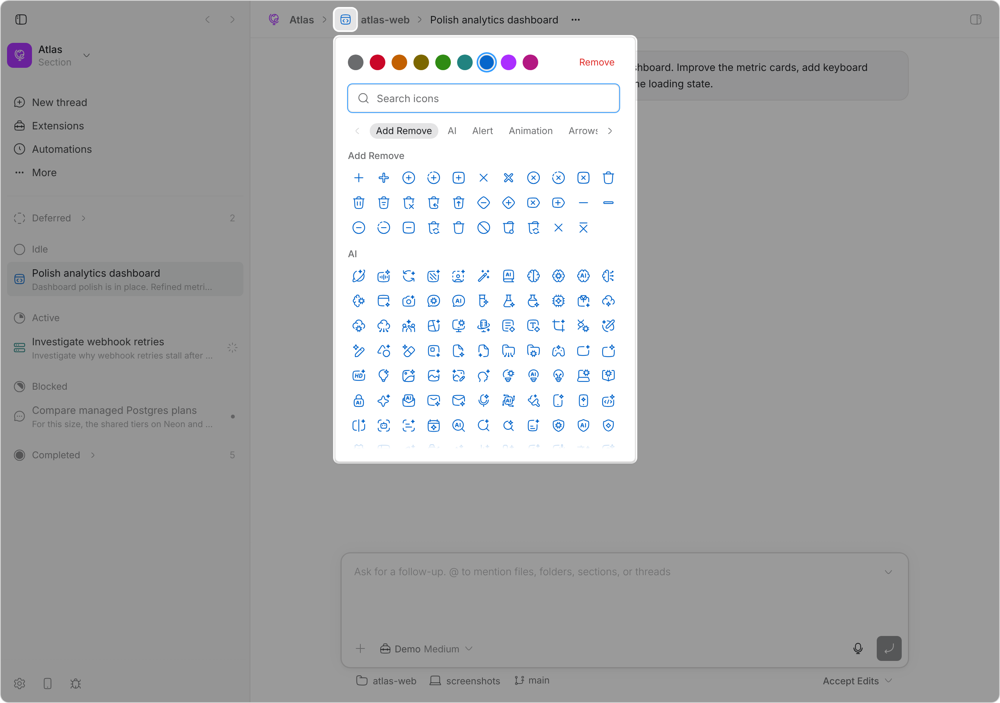

# Icons

Gives every thread section and every project an icon and an optional color, and
draws it wherever bb names a section or a project: bb's own sidebar headers, the header
above a thread and above a project's own screens, the prompt box and the menus
it opens, and the [Ribbon sidebar](../bb-plugin-ribbon-sidebar#readme).

Click one on a sidebar header, in the thread header, or on the strip under an
open thread to change it: search 5,930 icons by name or synonym, filter by
category, and pick a color. Changes save as you click and appear everywhere at
once.

Sections default to bb's own section mark — Hugeicons has none, so the plugin
composes it, which is why it is the one glyph here that is not from the
catalog. Projects default to a folder and bb's personal project to a chat
bubble, because that is what bb draws itself.

<picture>
  <source media="(prefers-color-scheme: dark)" srcset="assets/screenshot-dark.png">
  
</picture>

The icon comes from [Hugeicons](https://hugeicons.com), the same set bb itself
draws from, so it matches bb's chrome exactly. Projects default to a folder;
bb's personal project always shows a chat bubble and cannot be changed.

Choosing a color is optional. Without one the icon inherits the surrounding
text color, which keeps it themed; picking one of bb's eight favicon colors —
red, orange, yellow, green, teal, blue, purple, or pink — overrides that.

## Install

Add this repository as a bb marketplace, then install the plugin from it:

```sh
bb marketplace add git:github.com/ariofrio/ribbon
bb plugin install icons@ribbon
```

Skip the first line if you already added the marketplace for another plugin.

Update an installed copy with:

```sh
bb plugin update icons
```

## Where the catalog lives

The catalog is served by the plugin backend, not bundled into the app. The
client ships at 54 KB gzipped and fetches the full set once, the first time
the picker opens; a chosen icon travels with its drawing so other plugins can
render it without shipping the catalog themselves.

## The icon catalog

`npm run build:catalog` regenerates `src/icon-catalog.json` and
`src/icon-catalog.generated.ts` from Hugeicons' published index. It includes
every category and numbered name variant, and drops anything the free package
does not export — 5,936 icons across 60 categories. The picker then reserves
the six glyphs bb or this plugin already draws for sections, projects, and
projectless threads, leaving 5,930 choices. The result is committed, so builds
and CI never reach the network.

That index is unversioned and sends no `ETag` or `Last-Modified`, and no
released package carries the tags, so regenerating silently adopts whatever
Hugeicons serves that day — it has already rewritten tags for icons this
catalog ships. `npm run check:catalog` derives the catalog again and reports
the icons whose tags or category moved, writing nothing, so drift can be read
before it is adopted.

## Where the icons appear

**bb's sidebar.** The icon sits at the head of a group's label row, where
Ribbon sidebar puts a group icon, which is what lines the group name up with the
New thread, Extensions, and Automations labels above it. bb shows section
groups only under *Manually* and project groups under *Organize → By project*,
so which headers exist depends on that setting.

Under *By project* that includes the personal project, which bb labels
*Threads* and wraps in no id of its own. Being unwrapped is not enough to know
it by — bb draws *Pinned* the same way, in the same list, and puts it first —
so it is known instead by what bb lets you do from its header: *New project*
and *New thread* are offered from that group and from no other. That also
tells it from the same group relabelled *Unorganized* under *Manually*, and
from the machineless bucket under *By machine*, where it holds whatever is
left rather than the personal project. A header that offers no creation gets
nothing, which errs towards no icon rather than the wrong one.

**The header.** One icon before each crumb
[Breadcrumbs](../bb-plugin-breadcrumbs#readme) draws above an open thread, and
none where that crumb is turned off. With no crumbs at all the header keeps a
single icon, the thread's project, the way a sidebar row does. Also before the
project's own crumb above its settings, the one screen where bb's header names
a project and no thread.

The picker does not offer the glyphs bb already draws for a project and for the
personal project, because a row holding one of those is indistinguishable from
having picked nothing.

**The prompt box.** Its project control and every project in the menu that
control opens, each project in the list `@` brings up, a project mentioned in
the prompt, and the strip under an open thread that names the project the
thread runs in.

Only the strip's icon opens the picker there. The others sit inside a control
bb already gave a job — a menu row that picks a project, a pill that opens one
— and one click cannot mean two things; the strip is one of bb's display chips
and does nothing when clicked, so the icon in it is free to. It lights on hover
the way bb's own controls beside it do, and draws its background outside its
own footprint so nothing shifts.

Each of the three can be turned off on its own in the plugin's settings, and
all three are on by default. Sidebars other plugins draw are their own; Ribbon
sidebar draws these icons through the contract below.

## How the icons get there

Breadcrumbs draws an empty marked span before each crumb and this plugin fills
it, because bb's SDK lets no plugin render another's component and these icons
belong between the crumbs. Unfilled the span occupies nothing. An anchor React
owns is also a container bb's foreign-DOM guard admits a fresh node into, which
bb's header is not.

bb offers a plugin one slot in the thread header and none anywhere else, so
everything but that slot is drawn from a content script that watches the
document. `placements.ts` is the whole list of places, one entry each, and
`decorate.ts` is the single piece of machinery behind them: finding, inserting,
and cleaning up all live there, so a new place costs an entry rather than a
module.

What goes into a place found that way is a marked, empty span, and the
stylesheet below paints it. React comes into it only where the icon has to
answer a click, portaled into that same span — so the surfaces that merely show
an icon hold plain DOM, which bb's foreign-node guard has no reason to refuse.

Where bb already draws a folder, the plugin hides bb's and stands in its place,
wearing the classes bb had chosen so it matches that surface's size and
muting. bb gets its folder back the moment the plugin stops. Where bb draws
nothing — its sidebar headers, a project's crumb — the icon goes at the head of
the row instead.

Telling *which* project a node is about is what differs between them. A
mentioned project carries its id, and a crumb links to it; everywhere else bb
prints the name and nothing more, so the plugin resolves the name against the
project list the backend sends with the icons, and leaves bb's own folder in
place when two projects share a name.

The thread header is the one exception, portaled the way
[Breadcrumbs](../bb-plugin-breadcrumbs#readme) portals the project name:
immediately before that breadcrumb when it is installed, and before the title
when it is not.

`placements.test.ts`, `header-dom.test.ts`, and `sidebar-dom.test.ts` pin every
shape against markup captured from a running bb, so a bb that moves one fails
locally rather than dropping an icon silently.

## Drawing these icons in your own plugin

While this plugin is installed it publishes one stylesheet holding every icon
anyone has chosen. Name an owner on a box you draw yourself and the glyph
arrives through the cascade — nothing to fetch, nothing to subscribe to, and no
work per row.

Mark the box with the owner it stands for:

```html
<span data-ribbon-icons-project="proj_a19f"></span>
<span data-ribbon-icons-section="sec_04b2"></span>
```

and paint it from the properties this plugin sets on that same element:

```css
.your-row-icon {
  display: inline-block;
  inline-size: 1rem;
  block-size: 1rem;
  background-color: var(--ribbon-icons-project-color, currentColor);
  mask: var(--ribbon-icons-project-glyph, var(--your-own-fallback))
    center / contain no-repeat;
}
```

The box, its size, and its fallback are yours. Each kind carries its own pair of
properties and nothing chains between them, so the `var()` chain you write is
the only precedence there is.

A color is set only where someone picked one, so an unpicked icon inherits the
color of the label beside it.

`document.documentElement` carries `data-ribbon-icons-ready` once the
stylesheet is in. Key off it for anything that should not exist without this
plugin; Ribbon sidebar collapses its row icons that way.

These names are additive: a kind or a property may be added, and none will
change meaning.

## Development

```sh
npm run release:check
bb plugin reload icons
```

`release:check` runs the tests and typecheck, checks the committed SDK
declarations are current, builds, and installs the packed npm artifact in a
temporary directory to validate its contents. `dist/` is built, never
committed. The package is not published to npm yet, but it stays publishable
so it can be.

## License

[MIT](LICENSE)
