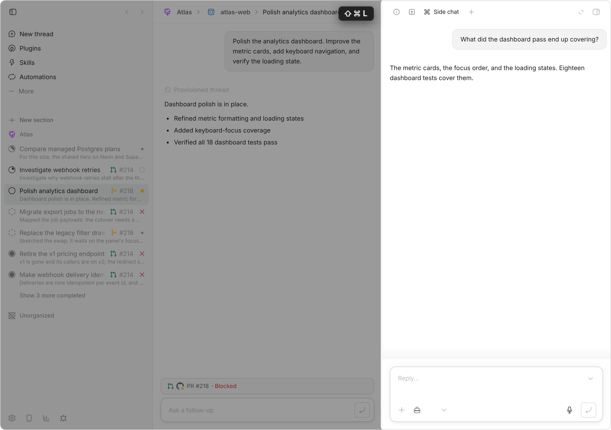

# Missing keyboard shortcuts

Adds commands and default keyboard shortcuts for navigation, thread creation,
composers, side chats, and terminals:

| Shortcut | Action                                               |
| -------: | ---------------------------------------------------- |
|       ⌘[ | Navigate backward in browser history                 |
|       ⌘] | Navigate forward in browser history                  |
|       ⌘N | Start a thread with no project selected              |
|      ⇧⌘N | Start a thread in the current thread's project       |
|       ⌘L | Focus the primary composer                           |
|      ⇧⌘L | Activate a side chat, or close it when focused       |
|       ⌃` | Activate a thread terminal, or close it when focused |

<picture>
  <source media="(prefers-color-scheme: dark)" srcset="assets/screenshot-dark.png">
  
</picture>

The commands appear in bb's command palette and Keyboard settings, where every
shortcut can be rebound or cleared. Shortcuts work while an input, editor, or
composer has focus. The side chat and terminal commands are available only on
a thread route.

bb leaves a plugin default unbound when it conflicts with a built-in command.
In bb 0.43.3, this affects ⌘N, ⇧⌘N, and ⌘L. Keyboard settings identifies the
conflict; clearing the built-in binding activates the plugin default, or you
can assign the plugin command another shortcut.

## Details

**⇧⌘N** uses the selected thread's project, or the last selected thread's
project when no thread is selected. The client remembers that project; before
any thread has been selected, the shortcut falls back to no project.

**⇧⌘L** creates a side chat only when none exists. Otherwise it selects the
active or most recently used side chat, opens the right sidebar, and focuses
its secondary composer. When that composer is already selected, visible, and
focused, the shortcut closes the right sidebar and focuses the primary
composer instead.

**⌃`** creates a terminal only when none exists. Otherwise it selects the most
recently used terminal, opens the right sidebar, and focuses it — and closes
the right sidebar when that terminal is already selected, visible, and
focused. Terminal focus recency is remembered per client and per thread;
terminal input time provides the fallback ordering when the client has not
focused one yet.

## Install

Add this repository as a bb marketplace, then install the plugin from it:

```sh
bb marketplace add git:github.com/ariofrio/ribbon
bb plugin install missing-keyboard-shortcuts@ribbon
```

Skip the first line if you already added the marketplace for another plugin.

Update an installed copy with:

```sh
bb plugin update missing-keyboard-shortcuts
```

## Development

```sh
npm run release:check
bb plugin reload missing-keyboard-shortcuts
```

`release:check` runs the tests and typecheck, checks the committed SDK
declarations are current, builds, and installs the packed npm artifact in a
temporary directory to validate its contents. `dist/` is built, never
committed. The package is not published to npm yet, but it stays publishable
so it can be.

## License

[MIT](LICENSE)
