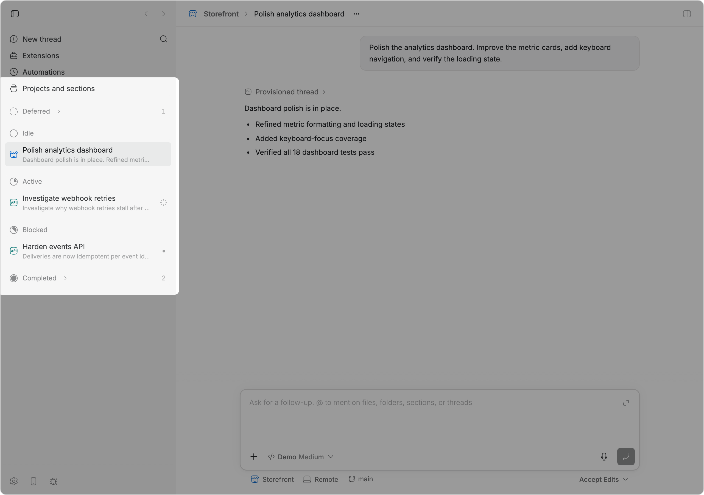

# Thread stages

A bb sidebar that organizes root threads into stages. It preserves
bb's pinned-thread and subthread behavior, then groups the remaining root
threads into manually ordered **Deferred**, **Idle**, **Active**, **Blocked**,
and **Completed** sections.

<picture>
  <source media="(prefers-color-scheme: dark)" srcset="assets/screenshot-dark.png">
  
</picture>

Child threads do not have stages or positions of their own. They
always render beneath their parent, inherit the root parent's stage, and move
with that parent. Their thread actions therefore omit stage controls.

Each row shows its project's icon, or its section's where that project has none
of its own, when the [Icons](../bb-plugin-icons#readme) plugin is installed, so a
stage-grouped list still tells you what a thread belongs to. An owner carries an
icon only once someone picks one, so a row nobody has touched falls through to
the project's default glyph. A thread takes the nearest section walking up, its
own included. Without that plugin the rows look as they always have. Message previews remain visible by
default and can be hidden in the plugin's settings for a denser list.

Use **Projects** (or **Projects and sections** when sections exist) above the
stages to focus the whole sidebar—including pinned and search results—on one
project or one native thread section. Its menu retains the **All projects** or
**All projects and sections** choice for clearing the filter. The control shows
the selected project's Icons glyph, a folder when that plugin is absent, the
chat glyph for the personal **Threads** project, or the section glyph for a
selected section. A filter indicator appears beside the selected label. The
selection is stored only in the current browser and
does not change stage assignments or synchronization.
The adjacent actions and matching dropdown items create a project through bb's
native host folder picker or open the New section dialog. Collapsed, nonempty stages show the number of
filtered root threads; expanded and empty stages omit the count. An experimental
setting can add the highest-priority aggregate activity indicator to collapsed
stage headers, immediately to the right of the count. On a client with no saved
collapse choices, Deferred and Completed start collapsed; Idle, Active, and
Blocked start expanded. Saved choices from the former stage names migrate.
Deferred and Blocked can each be disabled in plugin settings. A disabled stage
stays visible while it still contains threads, but no longer accepts moves;
after it is emptied, it disappears.

Drag root threads to reorder or change their stage. Ordering uses
fractional keys, so a move updates only the moved thread. A root hierarchy
moves from **Idle** to **Active** when a turn or background command starts
anywhere in the hierarchy, and returns to **Idle** once none are working.
These automatic changes apply only while the root is in **Idle** or **Active**.
**Deferred**, **Blocked**, and **Completed** are not managed automatically: a
root filed there stays there regardless of later activity. A thread blocked on
a question or approval counts as **Idle** only when no background command is
running anywhere in the hierarchy.

## Install

Add this repository as a bb marketplace, then install the plugin from it:

```sh
bb marketplace add git:github.com/ariofrio/ribbon
bb plugin install thread-stages@ribbon
```

Skip the first line if you already added the marketplace for another plugin.

Then select **Thread stages** in **Settings → Appearance → Sidebar**.

Update an installed copy with:

```sh
bb plugin update thread-stages
```

## Ribbon sidebar migration

Thread stages is also the provider and compatibility source for the
`plugin:thread-stages:stages` grouping. It exposes the versioned
`getGroupingCatalogV1`, `getPlacementMigrationSnapshotV1`, and
`acknowledgePlacementMigrationV1` RPCs so Ribbon sidebar can import placement
without reaching into this plugin's database.

Installing Ribbon sidebar does not transfer anything by itself. Thread stages
continues to own its sidebar, CLI, ordering, automation, undo, and retention
behavior until Ribbon acknowledges the same installation ID and placement
revision it imported. That acknowledgement atomically makes the legacy
placement tables read-only. From then on, stage actions, shortcuts, the legacy
CLI, and lifecycle automation forward to Ribbon; retention and undo read
Ribbon's authoritative placement. A failed dependency call reports a Ribbon
sidebar dependency problem and schedules reconciliation without resuming writes
to the frozen source. The legacy slot shows recovery guidance and bb's original
thread list after the handoff.

Deferred and Blocked visibility remains provider-owned, along with stage
automation and Completed retention. Provider setting changes invalidate
Ribbon's cached catalog.

## Keyboard shortcuts

On a thread route, `.` chords set the open thread's stage and move you
on:

| Shortcut | Stage       | Then                           |
| -------: | ----------- | ------------------------------ |
|  ⌘. / ⌥⌘. | Completed   | Go to the thread below it      |
|      ⇧⌘. | Idle        | Stay, or undo your last filing |
|     ⌃⇧⌘. | Blocked     | Go to the thread below it      |
|      ⌃⌘. | Deferred    | Go to the thread below it      |

**Active** has no chord because Thread stages assigns it automatically.
Moving a thread to **Completed** does not archive it immediately. Auto-archive
defaults to **7 days**; plugin settings can instead archive eligible threads
after 1 or 30 continuous days in Completed, or disable it with Never. The
hourly sweep skips a hierarchy only when its root or a descendant is pinned.
Otherwise it archives every parent-linked level from the bottom up, preserving
the hierarchy even when threads are unread, running, or waiting. Reordering
does not reset the timer, and the Completed assignment is preserved if a
thread is later unarchived.

Filing a thread moves you down the Idle stage, so the chords walk it in
place: you land on the row below the one you filed, or on the row above it
when you file the last one. Filing a thread that was not in Idle starts you at
the top instead. Pinned threads are skipped, and when Idle empties you land on
a composer with no project selected.

**⇧⌘.** brings the open thread back to Idle and leaves you there. When it is
*already* Idle, the shortcut undoes instead: the thread you filed most recently
returns to Idle, in the position it held, and you go to it. Press again to
walk further back, like reopening closed tabs. Only moves you made in bb count
as yours, so a thread an agent filed itself stays filed.

Arrow chords move the open root thread:

|    Shortcut | Move                               |
| ----------: | ---------------------------------- |
|   ⌥⌘↑ / ⌥⌘↓ | One position within its stage     |
| ⌥⇧⌘↑ / ⌥⇧⌘↓ | To the top or bottom of its stage |
|   ⌃⌘↑ / ⌃⌘↓ | To the stage above or below       |

A move that would leave a thread where it already is does nothing, and moving
to another stage appends it there. Reordering moves root threads
while keeping their entire child-thread hierarchy attached, and reorders a
pinned root thread within the pinned section. The backend resolves each move
and rejects stage shortcuts on child threads, whichever sidebar is displayed.

All of these shortcuts work while an input, editor, or composer has focus. They
use exact modifier matching, ignore held-key repeats, and stop matched key
events from propagating to downstream BB or editor handlers.
Shortcuts for disabled stages are left unclaimed.

## CLI

```sh
bb thread-stages list [--stage <stage>] [--json]
bb thread-stages show [<thread-id> | --self] [--json]
bb thread-stages update [<thread-id> | --self] [--stage <stage>] [--after <thread-id>] [--before <thread-id>] [--json]
```

Stage input is case-insensitive. `update` without `--after` or `--before`
places a thread at the bottom only when its stage changes; repeating its
current stage is a no-op. A neighbor outside the destination stage is ignored with a
warning.

Child thread IDs are rejected because their stage belongs to the root
thread.

## Development

```sh
npm run release:check
bb plugin reload thread-stages
npm run qa:project-filter-hover
npm run qa:sidebar-indicator-alignment
```

`release:check` runs the tests and typecheck, checks the committed SDK
declarations are current, builds, and installs the packed npm artifact in a
temporary directory to validate its contents. `dist/` is built, never
committed. The package is not published to npm yet, but it stays publishable
so it can be.

`qa:project-filter-hover` opens an isolated browser against `BB_SERVER_URL` and
fails if a sticky stage shield covers the thread filter's rounded bottom edge
or an empty project filter loses the sidebar's horizontal inset.
`qa:sidebar-indicator-alignment` verifies that collapsed-stage activity and
unread indicators share the same trailing alignment as thread indicators.

## License

[MIT](LICENSE)
