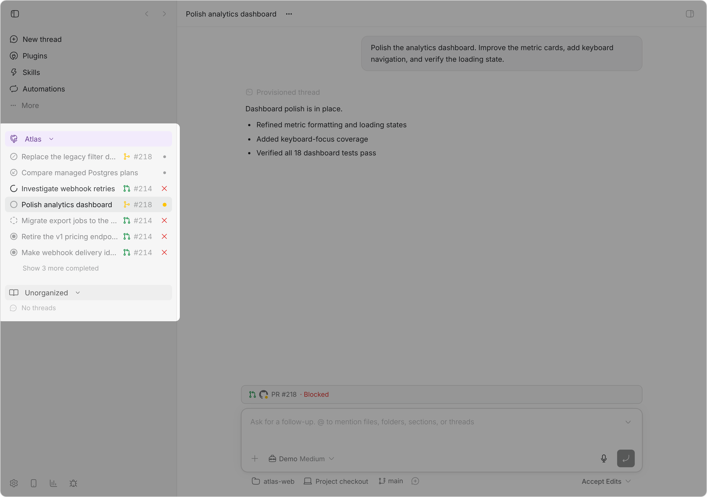

# Thread stages

bb's thread list with workflow stages, stable thread order, and section and
project icons.

<picture>
  <source media="(prefers-color-scheme: dark)" srcset="assets/screenshot-dark.png">
  
</picture>

Install it and select **Thread stages** under **Settings → Appearance →
Sidebar** (bb 0.45.0 or newer):

```sh
bb marketplace add git:github.com/ariofrio/ribbon
bb plugin install thread-stages@ribbon
```

## Where it comes from

This plugin is a fork of bb's own sidebar thread list, the built-in
[`plugins/thread-list`](https://github.com/get-bb/bb/tree/desktop-v0.45.0/plugins/thread-list),
so it keeps everything bb's list does — pinned threads, custom sections,
projects, machines, nested threads, drag to reorder, inline rename, search,
the Organize, Sort, and Filter menus, and bb's own status glyphs — and adds
workflow stages, a stable manual order, prompt buttons, pull request marks,
and icons on top. It replaces the earlier Ribbon sidebar, Thread stages, and
Icons plugins, and imports their data on first load.

The upstream files keep their upstream-relative paths under `src/`, and
[`fork.json`](../../fork.json) in the repository root pins the bb release they
are in step with. `npm run fork:sync -- desktop-v<version>` merges a newer
release three-way; `npm run fork:diff` prints the fork's own changes in
upstream paths, so a fix that belongs to bb can travel there as a patch. bb's
UI components under `src/components/`, `src/lib/`, and `src/hooks/` are
vendored from bb's component registry by `npm run build:ui`. Everything of
the plugin's own lives under `src/ribbon/` and `src/icons/`.

## Grouping and ordering

Choose **⋯ menu → Organize → Custom** for sections or **By project** for
projects, or **By machine** for machines. Each keeps its own order and collapsed headings. A stage says whose
move a thread is waiting on: **Active** is the user's or the thread's own,
**Blocked on other agent** is another bb thread's, **Blocked on third party**
is someone or something outside bb, **Deferred** is set aside, and
**Completed** is done. Waiting on the user is Active, never a Blocked stage.
Inside each group, Active and both Blocked stages share one manually ordered
list, followed by Deferred and then Completed. New roots enter at the top, and
activity leaves positions unchanged.

**⋯ menu → Sort by → Custom** selects this saved manual order and is the
default. Updated at, Created at, and Alphabetical sort rows within each stage
list instead; switching back to Custom restores their saved positions. The
choice applies across groups and organizations. In the CLI, `chronologicalSort`
is `none` for Custom, or `updated`, `created`, or `alpha` for automatic sorting.
Dragging or using a shortcut to reorder rows switches back to Custom.

Deferred and Completed preview roots in their containing group’s saved order; entering Completed
inserts a thread first. **Completed and Deferred preview rows** sets a limit of 1–5 rows
per stage, defaulting to 2, including **Show N more deferred/completed**.
With two or more threads, the default shows one thread and that button;
a single thread shows on its own. At limit 1, a single thread shows on its
own; multiple threads show only the button. The open thread replaces a preview
row when needed. **Show fewer** restores the preview, and search reveals every
matching result.

Drag a root to reorder it within its list, onto its section's heading to put
it first, or onto another section to move it there. Drag a child to reorder
it among its siblings; it stays under its parent and keeps its stage.
Active and both Blocked stages share the main list; changing between those
stages keeps a root's position. Every band follows its section, project, or machine order;
reordering in one organization leaves the other organization’s order unchanged.
Moving a root into another list defaults to the top through the UI or CLI,
and it can then be reordered by dragging, shortcuts, or CLI placement.
Returning a deferred or completed root to Active restores its main-list
position, and undo restores the position before a stage move.
bb owns section membership, pins, and lifecycle; project
membership is bb's under project grouping too.

Each child has its own stage while remaining nested under its parent, and
each parent keeps its own child order in every grouping; children not yet
reordered enter at the top, newest first. Forks inherit their source thread's
stage and hierarchy's section; unparenting preserves the child's stage and
copies the former root's section placement.

Children hang from their parent by a bar in their own stage-ring column, which
fills in for a hidden Active ring and parts around a shown one. Set **Child
thread lines** to Tree to branch a line from the parent into each child's ring
instead, or into a small hollow node while that ring is hidden.

## Icons and headings

Every section and project has an icon and an optional color. Use a heading's
**⋯ menu → Change icon** to search 5,930 [Hugeicons](https://hugeicons.com)
glyphs by name or synonym, filter by category, and pick one of bb's eight
favicon colors. Changes save as you click and appear in every window.

A heading with a color is tinted by its hue; every other heading is gray. A
heading whose group chose no icon carries a standard one: a book for a
section, a folder for a project, and two messages for Threads, open while the
group is. The book's top page turns over on its spine, the folder's front
falls forward, and the second message slides back behind the first as its
group folds. **Group header icons** turns them all off.

A folded group still shows the open thread as its one row, and a click on a
heading anywhere but its buttons folds or unfolds it; a double click on the
name renames it.

## Rows

Running work never changes a stage. A working thread's stage icon turns its
ring in place of bb's spinner, a collapsed root's ring also turns for work in
its hidden descendants, and a pending question or approval stops the ring. A
working row shimmers across its icon, title, and indicator; turn off
**Shimmer working rows** to keep bb's shimmer on the indicator alone. A
workflow, background agent, or background command left running by an idle
agent shimmers only its indicator, and the ring holds still.

A title runs to the row's edge unless something stands in the trailing
lane: a status indicator, a PR number, or a toggle for hidden children.
Hovering the row opens the lane for its actions. A title that outgrows its
row fades out at the edge and, while the row is
hovered or focused, pans to its end and back. **Long titles** in the plugin's
settings keeps the fade but not the pan, or cuts titles with bb's ellipsis
instead. The pan respects reduced motion.

Use a thread's **⋯ menu → Edit actions** to add labeled prompts. Their
buttons appear beside the thread title, colored like the section, project, or machine,
and send the saved prompt to that thread when clicked. **Hide thread title**
gives them the whole row.

The same actions are available through `bb thread-stages actions list`, `set`, and
`run`. Pass a thread ID or `--self`; `set --actions '<json-array>'` replaces
the buttons, and `run <action-id>` sends a saved prompt. See the
[Thread actions skill reference](skills/thread-stages/SKILL.md#thread-actions)
for the JSON format and title setting.

A thread's pull request adds its status. Its icon beside the PR number is
green while open, amber once auto-merge is on or it is in the merge queue,
purple when merged, red when closed, and muted while a draft. The status
indicator adds GitHub's marks: a red ✗ when CI fails, changes are requested,
or the branch conflicts; an amber ● while it waits on CI or a review; and a
green ✓ when it is ready to merge. A ✗ outranks unread completions, a ✓ waits
until the thread is read, and a ● shows only when nothing else needs the row.
Hover the PR number to see what the mark stands for. **Pull request marks**
in the plugin's settings turns the marks off. Auto-merge, reviewers,
and check counts come from the GitHub CLI (`gh`) signed in on the bb server's
machine; without it, marks follow bb's own pull request status.

**⋯ menu → Organize → Rows → Pull requests** shows the number beside each title
or hides it along with its mark. **Equal-width PR digits** in the plugin's
settings lines the numbers up.

## Stages and shortcuts

Type `@` and a stage name in the composer to mention a stage, such as
`@Blocked on other agent`. A mentioned stage tells the agent to place the
thread there, so a message can end with "then @Blocked on other agent", and a
queued message can be just the mention. Mentions of `@Idle` and `@Blocked` in
older messages still resolve: Idle is now Active, and Blocked is split into
the two Blocked stages.

When you or another thread move a thread to a different stage, the plugin
sends that thread "Thread stage updated: @Active → @Blocked on third party",
with agent-only
context that tells the agent who moved it. The message steers a running turn
or starts one on an idle thread. Automatic placement and a thread moving
itself through the CLI send nothing. Turn off **Message threads when their
stage changes** to stop these messages.

Completed threads auto-archive after seven days; **Auto-archive completed
threads** can choose 1 or 30 days instead, or Never. A hierarchy archives only
when every descendant is also Completed long enough; a Completed child can
archive while its parent stays open. Subsequent updates restart the timer, and
any pinned member prevents archival. Rows carry no archive button: filing a
thread as Completed is how it leaves the list.

| macOS | Linux / Windows | Action |
| --- | --- | --- |
| ⌘. / ⌥⌘. | Ctrl+. / Ctrl+Alt+. | Complete and select the next main-list thread in this section or project |
| ⇧⌘. | Ctrl+Shift+. | Return to Active, or undo the latest filing in this section or project |
| ⌃⌥⌘. | Ctrl+Alt+Shift+. | Mark Blocked on other agent |
| ⌃⇧⌘. | Ctrl+Alt+Shift+, | Mark Blocked on third party |
| ⌃⌘. | Ctrl+Alt+, | Defer |
| ⌥⌘↑ / ⌥⌘↓ | Ctrl+Alt+↑ / Ctrl+Alt+↓ | Move within the main, Deferred, or Completed list, or a child among its siblings |
| ⌥⇧⌘↑ / ⌥⇧⌘↓ | Ctrl+Alt+Shift+↑ / Ctrl+Alt+Shift+↓ | Move to that list's edge |
| ⌃⌘↑ / ⌃⌘↓ | Ctrl+↑ / Ctrl+↓ | Move to the adjacent stage |

On a child thread, filing shortcuts change that child's stage and stay on it.
Shortcuts can be rebound in bb; bindings saved for the Ribbon sidebar's
commands carry over.

## Upgrading from Ribbon

The plugin reads the Ribbon sidebar's and the Icons plugin's databases once
on first load — placements, stages, thread actions, and icons — and keeps
its own copy from then on, with the Ribbon sidebar's choices for the four
settings that remain copied over once. The earlier Thread stages compatibility
plugin's data is taken over in place. Remove the three old plugins once this
one is installed; they draw nothing bb's list does not.

## CLI

Use `stage` to change workflow state and `order` to change manual position.
Section membership is BB core state; change it with `bb thread update`.

```sh
bb thread-stages list --section <section-id> --stage BlockedOnThirdParty
bb thread-stages show --self
bb thread-stages stage Completed --self
bb thread-stages list --include-children --stage BlockedOnThirdParty
bb thread update <thread> --section <section-id>
bb thread-stages order <thread> --by section --before <thread>
bb thread-stages order <thread> --by project --first
bb thread-stages order <thread> --by machine --last
bb thread-stages order <child> --before <sibling>
bb thread-stages children <thread>
```

Use `bb thread-stages` to discover the full command surface. `list --json`
includes the complete BB thread metadata plus named `project`, `section`,
and `machine` objects, `stage`, and `stageEnteredAtMs`. Filters compose:
`--section`, `--project`, `--machine`, and `--stage`. Archived and hidden threads
are excluded unless requested with `--include-archived` or `--include-hidden`.
Add `--include-children` to list nested threads with their own stages.
`show --json` returns the same thread view for roots, or a child's stage and
sibling position.

Section, project, and machine orders are independent. `--by` selects which
saved order `list` reads or `order` changes; it defaults to `section`.
Deferred and Completed are bands within that organization and use its order.
Order anchors must be in the same group and band; Active and both Blocked
stages share the main band. Children have one sibling order across all views.
With Custom sorting, a move to another section starts at the top, including
when returning to a section visited before. The thread menu, CLI, and core BB
membership updates use the same placement policy as a drop on the group
heading. Use `order` afterward to choose another position; automatic sorting
keeps its selected order.

The former `place` command remains available for existing scripts and installed
agent instructions, but is hidden from help. Legacy stage anchors change
section order. The old `list --scope` filter also remains supported; use the
explicit filters in new scripts.

The list's layout preferences — organization mode, sort, section order,
hidden groups, and collapsed groups — are bb's, stored by the plugin and
synced to every open window:

```sh
bb thread-stages prefs list [--json]
bb thread-stages prefs get <key> [--json]
bb thread-stages prefs set <key> <value> [--json]
bb thread-stages prefs reset <key> [--json]
```

## Development

```sh
npm run release:check
bb plugin reload thread-stages
```

`npm run build:catalog` regenerates the icon catalog from Hugeicons'
published index, and `npm run check:catalog` reports what would change
without writing.

[MIT](LICENSE)
